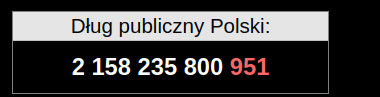

# debtcounter - Polish public debt counter

My attempt at Polish public debt counter

The counter uses functions called recursively via <code>setTimeout</code>. 

It can be easily used as a paste on a page with customizable speed.

<a href="https://html-preview.github.io/?url=https://github.com/ts-kontakt/debtcounter/blob/master/debt_counter_white.html" target="_blank">
Debt counter - white version</a>
